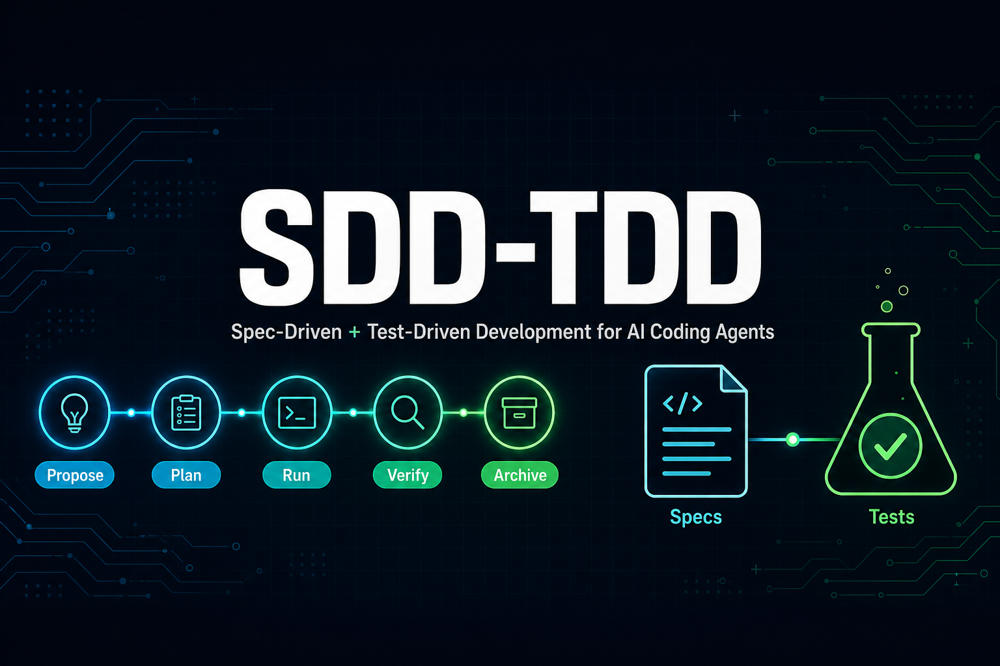
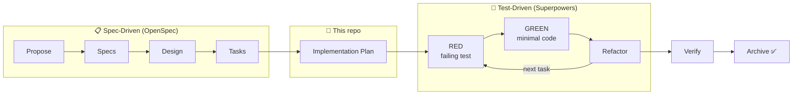

<div align="center">



# SDD-TDD

**One skill to bring Spec-Driven Development + Test-Driven Development to any AI coding agent.**

Powered by [OpenSpec](https://github.com/Fission-AI/OpenSpec) × [Superpowers](https://github.com/obra/superpowers)

[](LICENSE)
[](https://github.com/kxdds/sdd-tdd/pulls)
[](#-whats-inside)
[](#-supported-agents)
[](#-supported-agents)
[](#-supported-agents)

English | [简体中文](README.zh-CN.md)

</div>

---

## Why SDD-TDD?

AI coding agents are fast — but speed without discipline produces code you can't trust:

- **"Vibe coding" drifts.** Without a spec, the agent solves the problem it *imagined*, not the one you have.
- **Untested generation rots.** Code that was never seen failing a test is code you can't safely change.
- **Every agent reinvents the loop.** Cursor, Claude Code, Codex, OpenCode… each needs its own setup.

**SDD-TDD** fixes all three with a single, portable workflow:

> **Spec first** (OpenSpec: proposal → specs → design → tasks) → **Plan** → **TDD execution** (Superpowers: RED → GREEN → refactor) → **Verify** → **Archive**

Every line of code traces back to a spec'd task, and every task was proven by a failing test before it was implemented.

## How It Works



1. **`/opsx:propose`** — OpenSpec turns your idea into proposal → specs → design → tasks.
2. **`openspec-superpowers plan`** — every unchecked task is mapped to a concrete plan step: exact file paths, one focused failing test, RED command, minimal implementation, GREEN command.
3. **`openspec-superpowers run`** — strict TDD loop per step: watch the test fail, write the minimal code, watch it pass, refactor while green, check off both the plan and the OpenSpec task.
4. **`openspec-superpowers verify`** — lint, typecheck, full test suite, and OpenSpec status must all be clean.
5. **`openspec-superpowers archive`** — sync specs and archive the change. Always an explicit user action, never automatic.

## What's Inside

```text
skills/
├── bootstrap-sdd-tdd/        # Installer & uninstaller
│   ├── SKILL.md              #   setup: init OpenSpec, fork sdd-tdd schema, place bridge skill
│   │                         #   clean: remove everything it generated, restore defaults
│   └── agents/openai.yaml    #   Codex interface metadata
└── openspec-superpowers/     # The bridge skill your agent uses daily
    └── SKILL.md              #   plan / run / verify / archive modes
```

| Skill | What it does |
| --- | --- |
| **bootstrap-sdd-tdd** | One-command setup: checks dependencies, initializes OpenSpec, forks an `sdd-tdd` schema with an `implementation-plan` artifact, and installs the bridge skill into your agent's skills directory. Idempotent, and `clean` removes exactly what it created — nothing more. |
| **openspec-superpowers** | The daily driver. Bridges OpenSpec's artifact pipeline to Superpowers' `writing-plans`, `test-driven-development`, and `verification-before-completion` skills via four modes: `plan`, `run`, `verify`, `archive`. |

## Quick Start

### 1. Install the skills

Copy the `skills/` folders into your project's skills directory:

```bash
# macOS / Linux
git clone --depth 1 https://github.com/kxdds/sdd-tdd.git
# Pick the directory your agent reads:
#   Cursor:       .cursor/skills/
#   Claude Code:  .claude/skills/
#   Codex:        .codex/skills/
#   OpenCode:     .opencode/skills/
#   Gemini CLI:   .gemini/skills/
#   Universal:    .agents/skills/
cp -r sdd-tdd/skills/* <your-project>/.agents/skills/
```

```powershell
# Windows PowerShell
git clone --depth 1 https://github.com/kxdds/sdd-tdd.git
Copy-Item -Recurse sdd-tdd\skills\* <your-project>\.agents\skills\
```

### 2. Bootstrap your project

Ask your agent:

```text
bootstrap-sdd-tdd setup
```

The skill detects your agent, checks/installs [OpenSpec CLI](https://github.com/Fission-AI/OpenSpec) and [Superpowers](https://github.com/obra/superpowers) (with your consent), initializes the OpenSpec workspace, and wires up the `sdd-tdd` schema.

### 3. Ship a change, the disciplined way

```text
/opsx:propose add-rate-limiter          # spec it
openspec-superpowers plan add-rate-limiter    # plan it
openspec-superpowers run add-rate-limiter     # TDD it
openspec-superpowers verify add-rate-limiter  # prove it
openspec-superpowers archive add-rate-limiter # archive it (you decide when)
```

### Uninstall

```text
bootstrap-sdd-tdd clean
```

Removes everything setup generated, restores OpenSpec's default workflow, and never touches your changes, specs, or user-authored content.

## Supported Agents

| Agent | Skill directory | Superpowers install |
| --- | --- | --- |
| [Cursor](https://cursor.com) | `.cursor/skills/` | Plugin marketplace |
| [Claude Code](https://claude.com/claude-code) | `.claude/skills/` | `/plugin install superpowers` |
| [Codex](https://openai.com/codex) | `.codex/skills/` | Official INSTALL.md |
| [OpenCode](https://opencode.ai) | `.opencode/skills/` | Official INSTALL.md |
| [Gemini CLI](https://github.com/google-gemini/gemini-cli) | `.gemini/skills/` | `gemini extensions install` |
| Antigravity / others | `.agents/skills/` | Plugin or vendored fallback |

No plugin system at all? The bootstrap skill vendors Superpowers' skills directly into your project.

## Design Principles

- **Specs are the source of truth.** Code implements tasks; tasks trace to specs.
- **No code before a failing test.** RED before GREEN, every time.
- **Archive is a human decision.** The agent stops at verified; you press the button.
- **Leave no trace.** `clean` removes exactly what `setup` created. User content (`AGENTS.md`, changes, specs) is never clobbered — additions live inside marker comments.
- **Tool-agnostic by default.** One skill definition, every agent.

## FAQ

<details>
<summary><b>What is Spec-Driven Development (SDD)?</b></summary>

A workflow where every change starts as a written proposal, spec, and design before any code is generated. [OpenSpec](https://github.com/Fission-AI/OpenSpec) manages these artifacts as a pipeline with validation and archiving.
</details>

<details>
<summary><b>What is Test-Driven Development (TDD) for AI agents?</b></summary>

The classic RED → GREEN → refactor loop, enforced on the agent: it must write one focused failing test, observe the failure, write minimal code to pass, and refactor only while green. [Superpowers](https://github.com/obra/superpowers) provides the skill that keeps agents honest.
</details>

<details>
<summary><b>Does this replace OpenSpec or Superpowers?</b></summary>

No — it composes them. OpenSpec owns the spec pipeline, Superpowers owns the execution discipline, and this repo is the bridge (plus a bootstrapper that sets both up).
</details>

<details>
<summary><b>Will it overwrite my AGENTS.md or existing config?</b></summary>

No. All additions are appended inside `<!-- bootstrap-sdd-tdd:begin/end -->` markers, and `clean` removes only what's inside them.
</details>

## Related Projects

- [OpenSpec](https://github.com/Fission-AI/OpenSpec) — spec-driven development pipeline for AI coding
- [Superpowers](https://github.com/obra/superpowers) — battle-tested skills (TDD, planning, verification) for coding agents
- [Agent Skills](https://agentskills.io) — the emerging cross-tool SKILL.md convention

## Contributing

Issues and PRs are welcome! Especially:

- New host-tool mappings (more agents, more install surfaces)
- Improvements to the sdd-tdd schema or implementation-plan template
- Real-world workflow reports

## License

[MIT](LICENSE) © 2026 Loyal Chen
