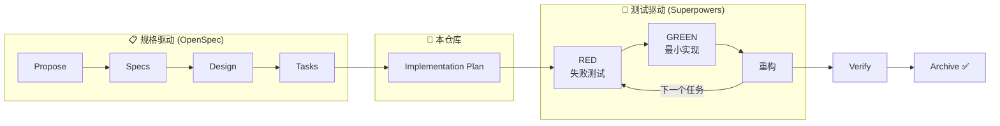

<div align="center">


# SDD-TDD

**一个 Skill，让任何 AI 编码智能体都能用上「规格驱动 + 测试驱动」开发流程。**

基于 [OpenSpec](https://github.com/Fission-AI/OpenSpec) × [Superpowers](https://github.com/obra/superpowers)

[](LICENSE)
[](https://github.com/kxdds/sdd-tdd/pulls)

[English](README.md) | 简体中文

</div>

---

## 为什么需要 SDD-TDD？

AI 编码智能体很快，但没有纪律的快，产出的是你不敢信任的代码：

- **「凭感觉编码」会跑偏。** 没有规格，智能体解决的是它*想象中*的问题，不是你的问题。
- **没经过测试的生成代码会腐烂。** 从没见过测试失败的代码，就是你不敢改的代码。
- **每个智能体都要重新搭一遍流程。** Cursor、Claude Code、Codex、OpenCode……各配各的。

**SDD-TDD** 用一套可移植的工作流同时解决这三个问题：

> **规格先行**（OpenSpec：proposal → specs → design → tasks）→ **计划** → **TDD 执行**（Superpowers：RED → GREEN → 重构）→ **验证** → **归档**

每一行代码都能追溯到规格中的任务，每个任务在实现之前都先被一个失败的测试证明过。

## 工作原理



1. **`/opsx:propose`** — OpenSpec 把你的想法变成 proposal → specs → design → tasks。
2. **`openspec-superpowers plan`** — 每个未完成任务映射为具体计划步骤：确切文件路径、一个聚焦的失败测试、RED 命令、最小实现、GREEN 命令。
3. **`openspec-superpowers run`** — 严格 TDD 循环：先看测试失败，写最小实现，看测试通过，绿灯下重构，同时勾掉计划和 OpenSpec 任务。
4. **`openspec-superpowers verify`** — lint、类型检查、完整测试套件、OpenSpec 状态全部通过。
5. **`openspec-superpowers archive`** — 同步规格并归档。永远由用户显式触发，绝不自动执行。

## 仓库内容

```text
skills/
├── bootstrap-sdd-tdd/        # 安装 / 卸载器
│   ├── SKILL.md              #   setup：初始化 OpenSpec、fork sdd-tdd schema、安装桥接 skill
│   │                         #   clean：精确移除所有生成物，恢复默认编排
│   └── agents/openai.yaml    #   Codex 接口元数据
└── openspec-superpowers/     # 日常使用的桥接 skill
    └── SKILL.md              #   plan / run / verify / archive 四种模式
```

## 快速开始

### 1. 安装 Skills

把 `skills/` 下的目录复制到你项目的 skills 目录：

```bash
git clone --depth 1 https://github.com/kxdds/sdd-tdd.git
# 按你的智能体选择目录：
#   Cursor:       .cursor/skills/
#   Claude Code:  .claude/skills/
#   Codex:        .codex/skills/
#   OpenCode:     .opencode/skills/
#   Gemini CLI:   .gemini/skills/
#   通用:         .agents/skills/
cp -r sdd-tdd/skills/* <你的项目>/.agents/skills/
```

### 2. 初始化项目

对你的智能体说：

```text
bootstrap-sdd-tdd setup
```

它会自动检测宿主工具，检查/安装 [OpenSpec CLI](https://github.com/Fission-AI/OpenSpec) 和 [Superpowers](https://github.com/obra/superpowers)（经你同意后），初始化 OpenSpec 工作区并配置 `sdd-tdd` schema。

### 3. 用纪律交付一个变更

```text
/opsx:propose add-rate-limiter                # 写规格
openspec-superpowers plan add-rate-limiter    # 做计划
openspec-superpowers run add-rate-limiter     # TDD 执行
openspec-superpowers verify add-rate-limiter  # 验证
openspec-superpowers archive add-rate-limiter # 归档（由你决定）
```

### 卸载

```text
bootstrap-sdd-tdd clean
```

只移除 setup 生成的内容，恢复 OpenSpec 默认工作流，绝不碰你的 changes、specs 或自己写的内容。

## 支持的智能体

| 智能体 | Skill 目录 | Superpowers 安装方式 |
| --- | --- | --- |
| [Cursor](https://cursor.com) | `.cursor/skills/` | 插件市场 |
| [Claude Code](https://claude.com/claude-code) | `.claude/skills/` | `/plugin install superpowers` |
| [Codex](https://openai.com/codex) | `.codex/skills/` | 官方 INSTALL.md |
| [OpenCode](https://opencode.ai) | `.opencode/skills/` | 官方 INSTALL.md |
| [Gemini CLI](https://github.com/google-gemini/gemini-cli) | `.gemini/skills/` | `gemini extensions install` |
| Antigravity / 其他 | `.agents/skills/` | 插件或 vendor 兜底 |

完全没有插件系统？bootstrap skill 会把 Superpowers 的技能直接 vendor 进你的项目。

## 设计原则

- **规格是唯一事实来源。** 代码实现任务，任务追溯规格。
- **没有失败测试就没有代码。** 每次都是先 RED 再 GREEN。
- **归档是人的决定。** 智能体止步于验证通过，按钮由你来按。
- **不留痕迹。** `clean` 精确移除 `setup` 创建的内容。用户内容（`AGENTS.md`、changes、specs）永不覆盖——所有追加都包在标记注释里。
- **默认工具无关。** 一份 Skill 定义，所有智能体通用。

## 相关项目

- [OpenSpec](https://github.com/Fission-AI/OpenSpec) — 面向 AI 编码的规格驱动开发流水线
- [Superpowers](https://github.com/obra/superpowers) — 久经考验的智能体技能集（TDD、计划、验证）

## 许可证

[MIT](LICENSE) © 2026 Loyal Chen
